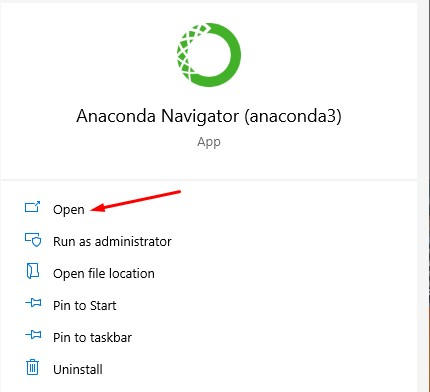
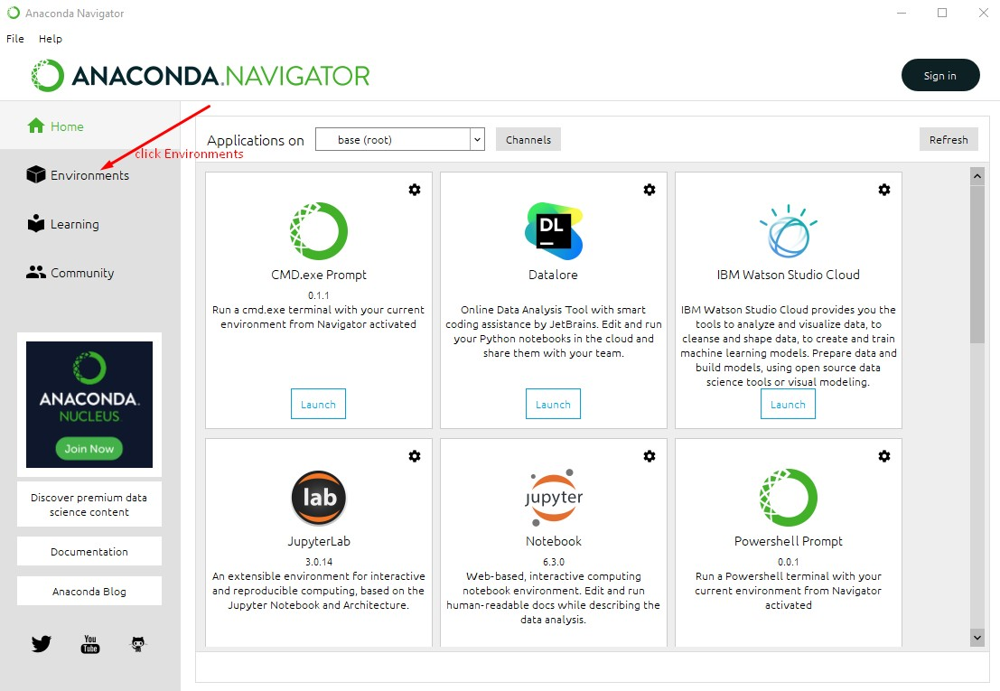
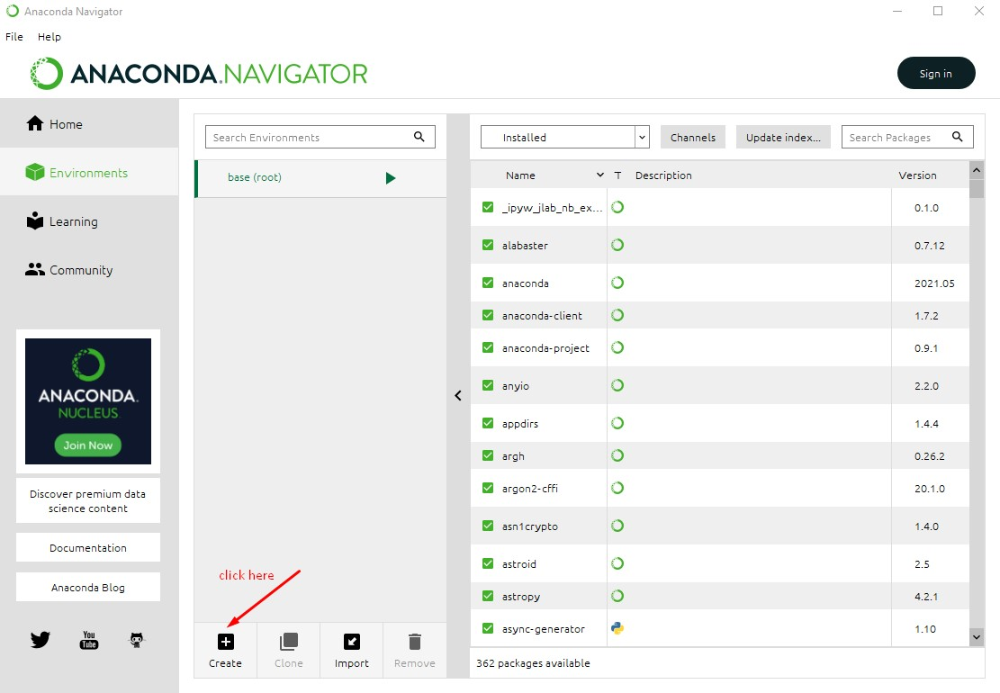
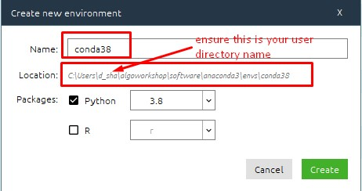
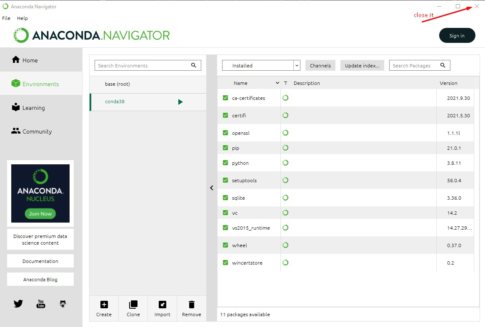

[Home](index.html)

### Configure Anaconda Environment
[Previous](install_anaconda.html)

In your windows search bar type 'Anaconda Navigator' and click on it and follow the below steps:

Screen 1

Screen 2

Screen 3

Screen 4

Wait for the creation to complete and then close it

Screen 5

[Next](install_pycharm.html)