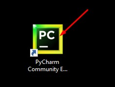
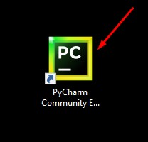
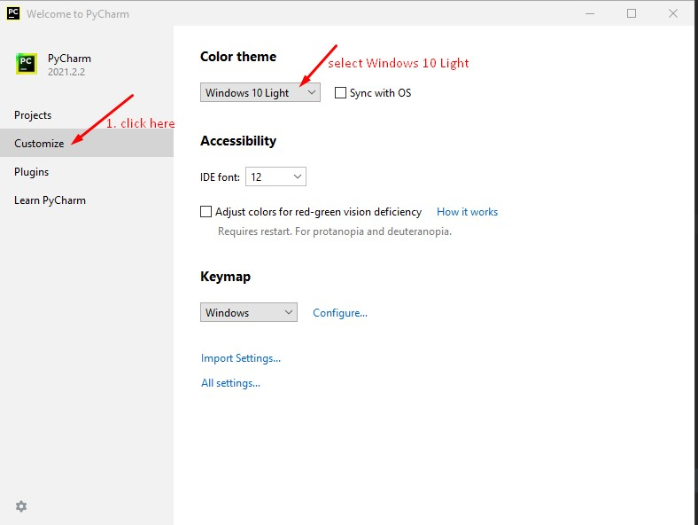
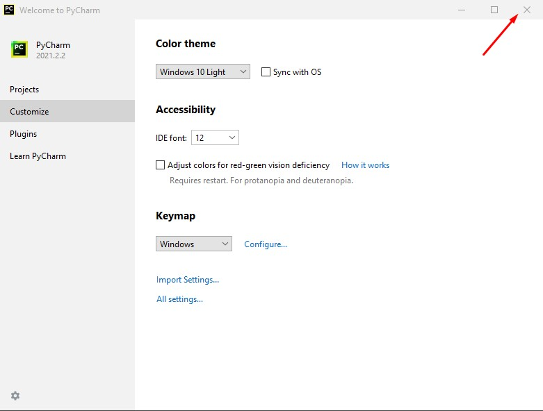

[Home](index.html)

### Configure & Setup Pycharm with Anaconda
[Previous](install_pycharm.html)

From your desktop Double-click on Pycharm shortcut to launch the Pycharm application.

Step 1

Step 2
If prompted with below dialogue select 'Do not import settings' and press Next.

Step 3 - Customize PyCharm

Step 4 - Close PyCharm

[Next](lesson1.html)