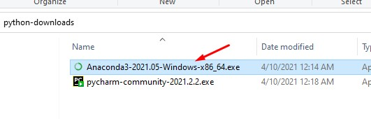
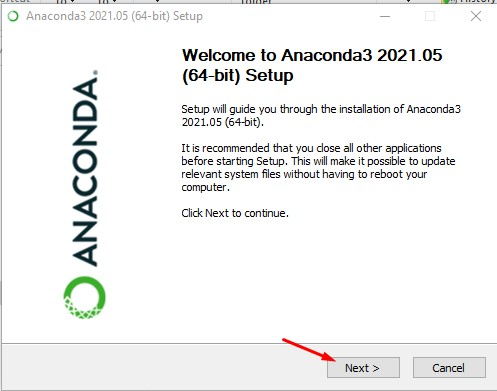
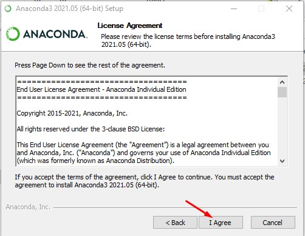
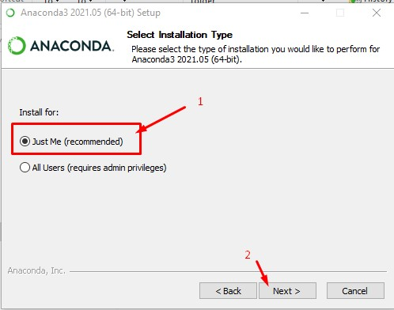
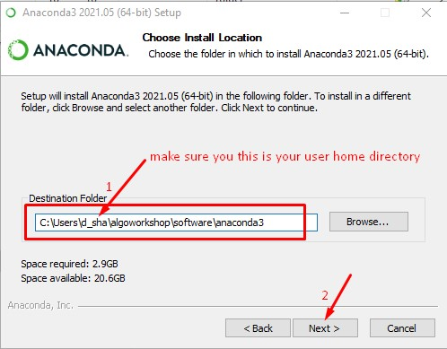
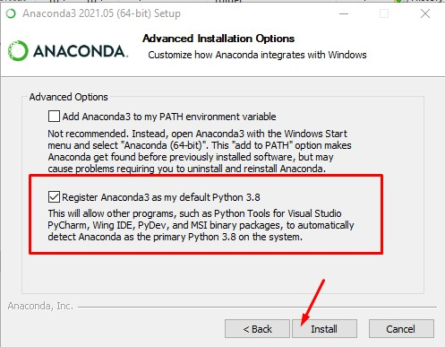
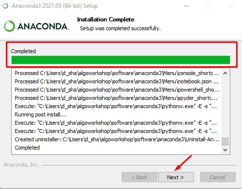
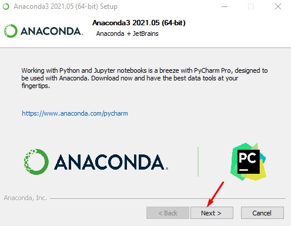
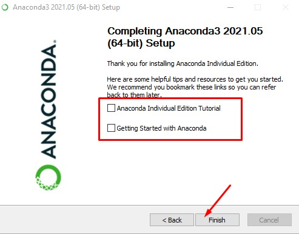

[Home](index.html)

### Install Anaconda python package
[Previous](install_setup.html)

Double-click on the Anaconda package that you have downloaded and follow the step-by-step instructions as shown below:

Step 1

Step 2

Step 3

Step 4

Step 5

Step 6

Step 7

Step 8

Step 9

[Next](config_anaconda.html)