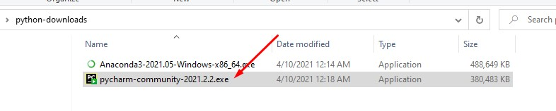
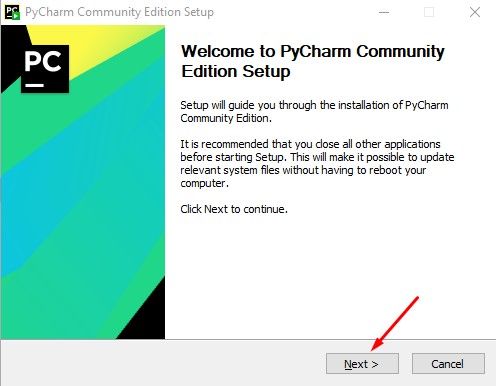
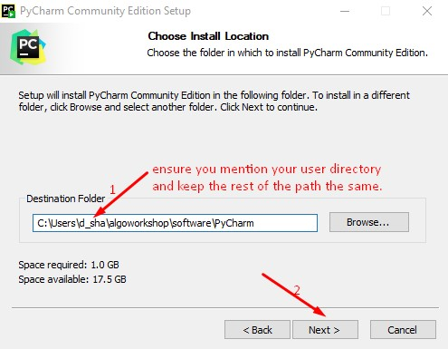
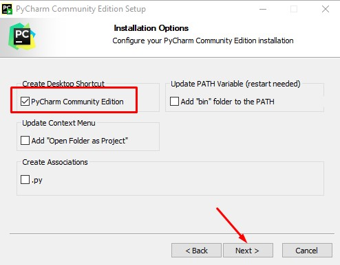
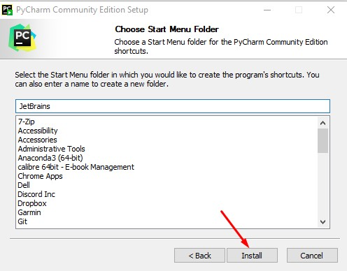
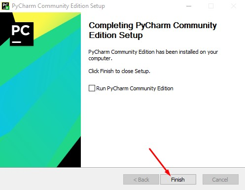

[Home](index.html)

### Install Pycharm
[Previous](config_anaconda.html)

Double-click on the Pycharm package that you have downloaded and follow the step-by-step instructions as shown below:

Step 1

If Windows prompt you asking 'Do you want to allow this app to make changes to your device?' click Yes and proceed.

Step 2

Step 3

Step 4

Step 5

Step 6

[Next](config_pycharm.html)