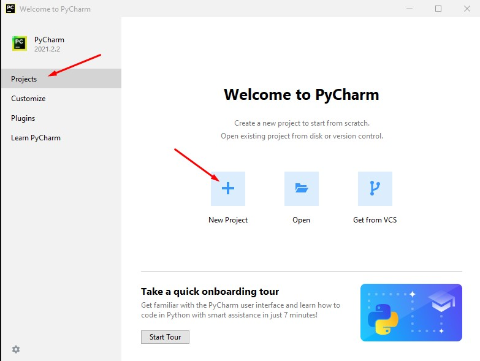
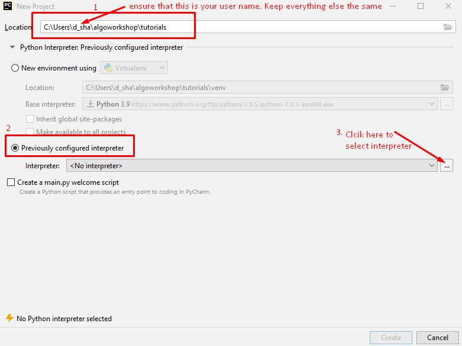
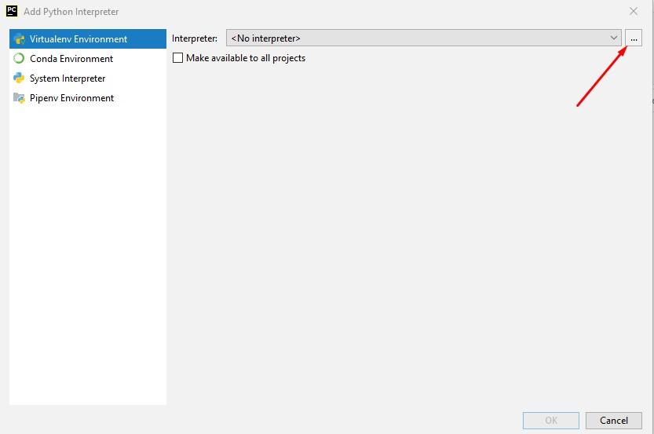
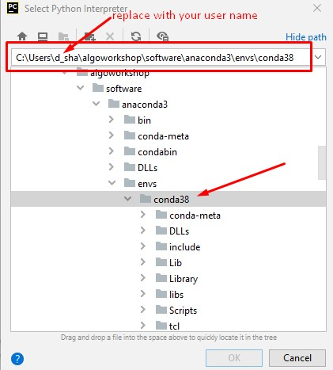
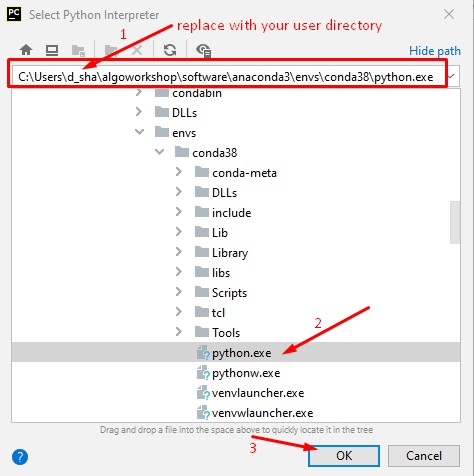
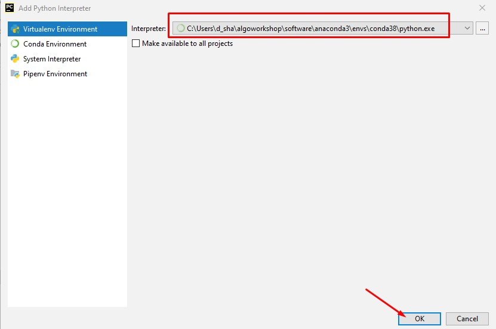
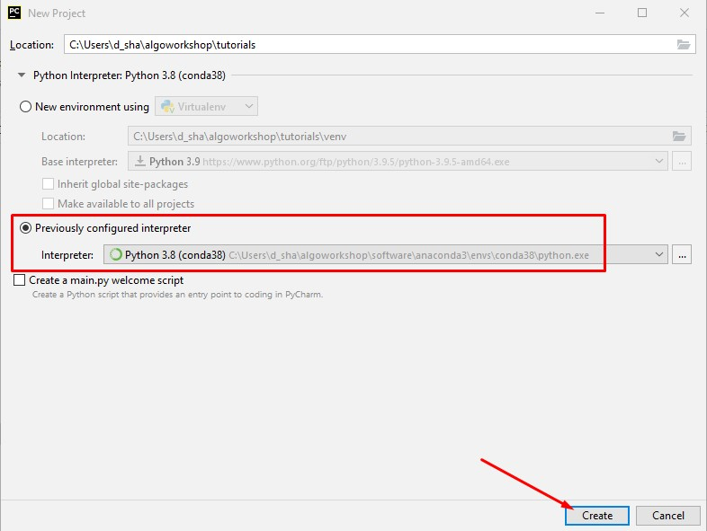
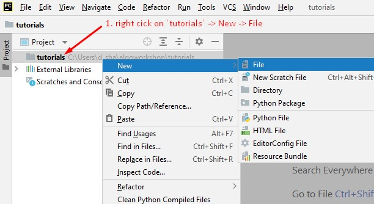
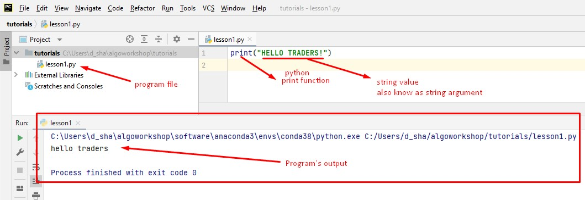

[Home](index.html)

### First Python Program
[Previous](config_pycharm.html)


Close PyCharm
From your desktop Double-click on Pycharm shortcut to launch the Pycharm application.  And click on New Project


Step 1




Step 2




Step 3




Step 4




Step 5




Step 6




Step 7




Step 8

Right click on tutorial folder and add a new file to the project.
Name the file `lesson1.py`



Type following in the file and save the file:

```
print("Hello TRADERS!")
```

Right Click anywhere in the file, and select `Run 'lesson1'`

Doing this will execute the python program. This program prints `Hello TRADERS!` on output terminal as shown in image.



To those who have never written a program before
*Congratulations!!*
You have just written your first python program.

To those more experienced a little more patience and we will soon start our algo trading lessons.


[Next](lesson2.html)