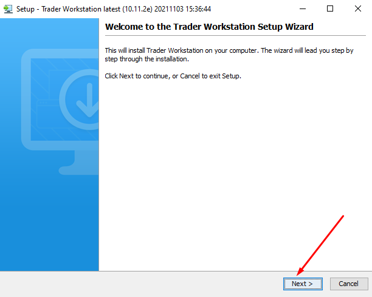
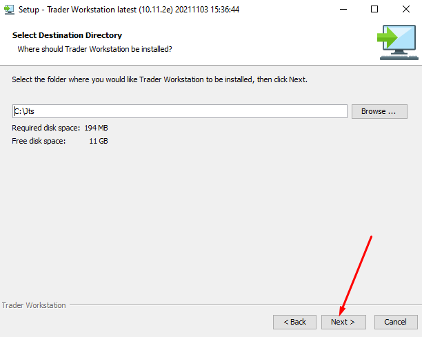
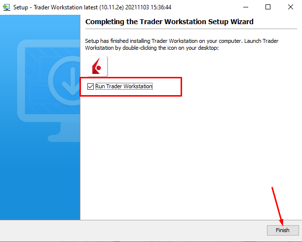
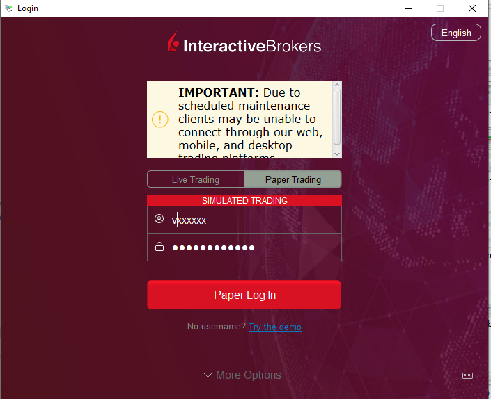
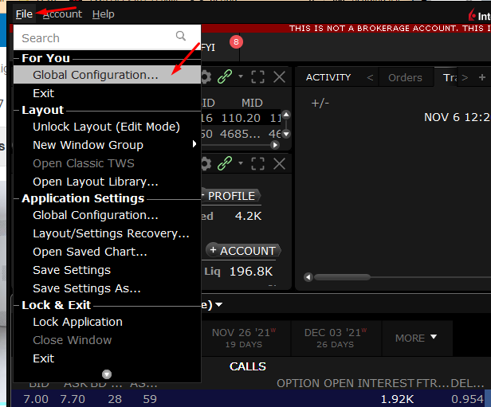
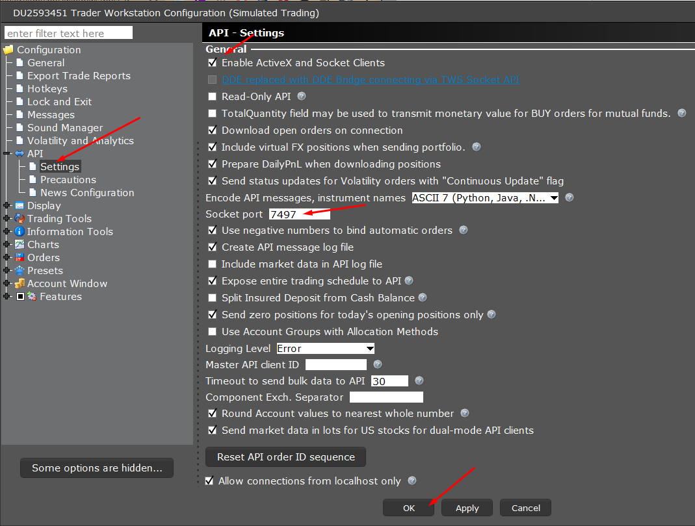
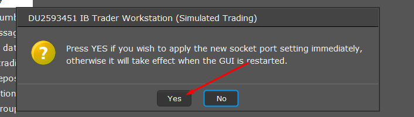

[Home](index.html)

### Live Trading - Interactive Brokers

[Previous](lesson7.html)

#### Download and InstallTWS Software

Download [TWS for Windows](https://download2.interactivebrokers.com/installers/tws/latest/tws-latest-windows-x64.exe)

Right click on the downloaded file and click on `Run as administrator`

  










#### Configure TWS for API access
Launch TWS (if not already open) & follow the below shown steps:

Login to IBKR TWS application. Make sure you select **Paper Trading** account.








#### Program to access Forex Data from IBKR
Create a file under `tutorials` folder and name it as `06.backtrader_live_trading_with_ibkr.py`

```python
import datetime as dt
import backtrader as bt


# conception -> birth -> childhood -> adulthood -> death
# init -> start -> prenext -> next -> stop

class MyStrategy(bt.Strategy):
    def __init__(self):
        print("initializing strategy")
        self.fastsma = bt.indicators.MovingAverageSimple(period=20)
        self.slowsma = bt.indicators.MovingAverageSimple(period=50)
        self.data_ready = False

    def log_data(self):
        current_date = self.data.datetime.datetime()
        open_price = self.data.open[0]
        close_price = self.data.close[0]
        print(f"{current_date}, O: {open_price}, C: {close_price}")

    def notify_data(self, data, status):
        print(f"status: {data._getstatusname(status)}")
        if status == data.LIVE:
            self.data_ready = True

    def next(self):
        print("next...")
        self.log_data()
        if not self.data_ready:
            return
        #If LIVE run your strategy
        if not self.position:
            self.buy(size=10)
        else:
            self.sell()

def run_main():
    cerebro = bt.Cerebro()
    ibstore = bt.stores.IBStore(host='127.0.0.1', port=7497, clientId=1)
    #see https://interactivebrokers.github.io/tws-api/basic_contracts.html
    data=ibstore.getdata(dataname='USD.JPY', sectype='CASH', exchange='IDEALPRO', timeframe=bt.TimeFrame.Seconds)
    cerebro.resampledata(data,timeframe=bt.TimeFrame.Seconds, compression=15)
    cerebro.broker = ibstore.getbroker()
    cerebro.addstrategy(MyStrategy)

    # start the engine
    cerebro.run()

run_main()

```
[Next](lesson9.html)